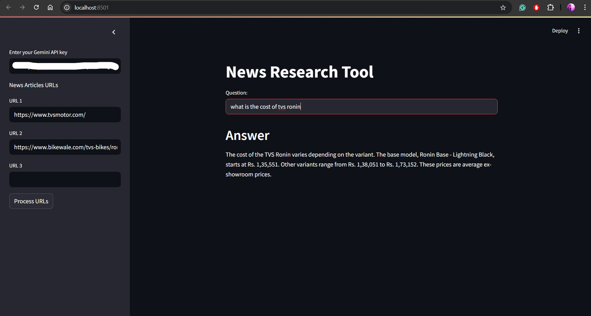

# 📰 News Research Tool

[](https://streamlit.io)

An AI-powered research assistant that takes news article URLs, processes their content, and lets you ask questions — with answers backed by source links. Built using **Gemini (Google GenAI)**, **LangChain**, **FAISS**, and **Streamlit**.

---



---

## 🚀 Features

- 🔗 Enter up to 3 news article URLs in the sidebar
- 📄 Automatically fetches and processes text from the URLs
- ✂️ Splits long content into searchable chunks
- 🤖 Ask any natural language question based on the articles
- 📚 Answers are generated by Gemini and include source references
- 🌐 Source links are shown so you can verify where the answer came from
- 🖥️ User-friendly web interface using Streamlit

---

## 🛠️ Tech Stack

| Component      | Technology                                              |
|----------------|---------------------------------------------------------|
| Language Model | [Gemini 1.5 Flash](https://ai.google.dev/)              |
| Framework      | [LangChain](https://www.langchain.com/)                |
| Embeddings     | [HuggingFace MiniLM](https://huggingface.co/)          |
| Vector Store   | [FAISS](https://github.com/facebookresearch/faiss)     |
| UI             | [Streamlit](https://streamlit.io/)                     |
| Data Loader    | `UnstructuredURLLoader` from LangChain                 |

---

## 🔐 API Key Required

To use this project, you need a **Google Gemini API key**.

> 🔑 Get your free API key from:  
> [https://makersuite.google.com/app/apikey](https://makersuite.google.com/app/apikey)

### 🧾 How to Use It

1. Run the app with:
   ```bash
   streamlit run main.py
