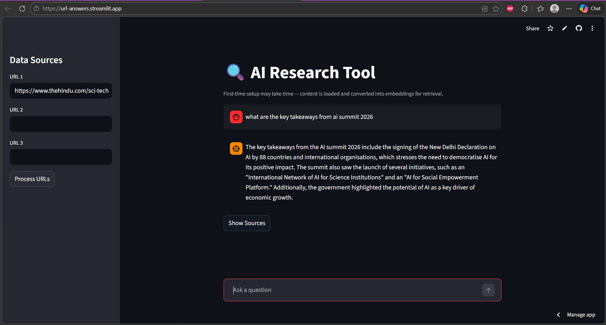

# 🔍 AI Research Tool (RAG)

An AI-powered research assistant that allows users to enter website URLs and ask questions based on their content.
The system uses **Retrieval-Augmented Generation (RAG)** with **FAISS + Groq (Llama 3.1)** to provide accurate and context-based answers.

---

## 🌐 Live 

**Try the app here:**
👉 https://url-answers.streamlit.app/

---

## 🖼️ Demo Screenshot





Example structure:

```
.
├── app.py
├── demo.png
├── requirements.txt
├── .env
├── .gitignore
└── README.md
```

---

## 🚀 Features

* Accepts up to **3 website URLs**
* Extracts and processes web content automatically
* Semantic search using **FAISS vector database**
* **MMR retrieval** for better and diverse results
* Conversational chat with **history awareness**
* Concise answers (3–5 sentences)
* **Show / Hide Sources** option
* Clean chat interface using **Streamlit**

---

## 🧠 How It Works

1. User enters URLs
2. Web content is loaded using `WebBaseLoader`
3. Text is split into chunks
4. Chunks → converted into embeddings (HuggingFace)
5. Stored in **FAISS**
6. User asks a question
7. Relevant chunks retrieved using **MMR**
8. Context + chat history sent to **Groq LLM**
9. AI generates a concise answer

---

## 🛠️ Tech Stack

* Python
* Streamlit
* LangChain
* FAISS
* HuggingFace Embeddings
* Groq (Llama 3.1)
* BeautifulSoup
* Requests
* Python-dotenv

---

## 📂 Project Structure

```
.
├── app.py
├── assets/
│   └── demo.png
├── requirements.txt
├── .env
├── .gitignore
└── README.md
```

---

## ⚙️ Setup Instructions

### 1. Clone the repository

```
git clone https://github.com/kadityapranihith/News-Research-Tool.git
cd News-Research-Tool
```

### 2. Create virtual environment

```
python -m venv venv
venv\Scripts\activate
```

### 3. Install dependencies

```
pip install -r requirements.txt
```

---

## 🔑 Environment Variables

Create a `.env` file in the root folder:

```
GROQ_API_KEY=your_groq_api_key_here
```

---

## ▶️ Run the Application

```
streamlit run app.py
```

The app will open in your browser.

---

## ⏳ Note

Initial processing may take time because:

* Web pages are loaded
* Content is split into chunks
* Embeddings are created for semantic search

---

## 📌 Use Cases

* Research from multiple websites
* News analysis
* Learning from documentation
* AI-powered content exploration
